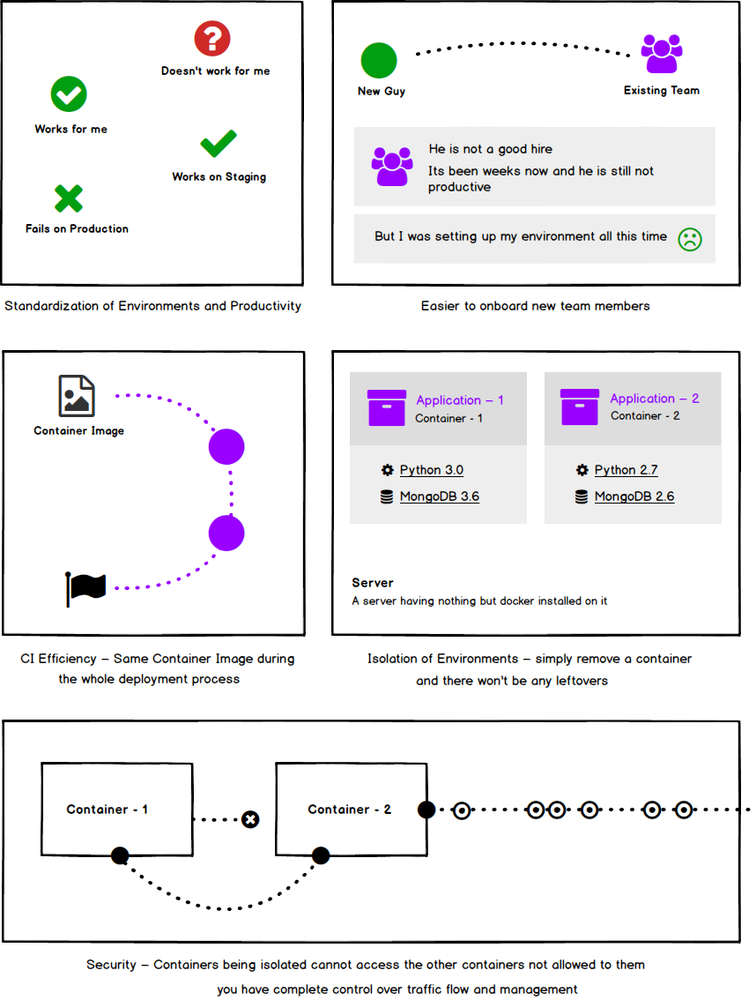

  
  <h1 align="center">Docker for Humans</h1>
  
Befriend yourselves with the cute fish!

  
Docker could seem scary, it really isn't. I will try to unravel everything that you need to know about docker in this guide and help you utilize it better in your daily job.

  

  	
  	
  	
  

## Table of Contents
* [Introduction](#introduction)
* [What is Docker?](#what-is-docker)
* [Containerization vs Virtualization](#containerization-vs-virtualization)
* [Comparing Docker to Vagrant or Virtual Machine](#comparing-docker-to-vagrant-or-virtual-machine)
* [Benefits of Using Docker](#benefits-of-using-docker)
* [Docker Under the Hood](#docker-under-the-hood)
* [Dockerfile](#dockerfile)
	- [What is Dockerfile](#what-is-dockerfile)
	- [What are Layers](#what-are-layers)
	- [Writing a Dockerfile](#writing-a-dockerfile)
	- [Running a Dockerfile](#running-a-dockerfile)
	- [Multi-stage Builds](#multi-stage-builds)
	- [Dockerignore](#dockerignore)
	- [Some Gotchas](#some-gotchas)
	- [Dockerfile Best Practices](#dockerfile-best-practices)
* [Docker Compose](#docker-compose)
* [Networks](#networks)
* [Volumes](#volumes)
* [Security](#security)
* [Registry and Repository](#registry-and-repository)
* [Best Practices](#best-practices)

## Introduction

I am going to be giving a talk to a small user group here in Berlin titled "Stupidly Simple Docker" and despite being thousands of articles and guides out there on the topic, I thought it would be better if I accompany the talk with a little "dumbed-down" guide to help those not attending. In this article I am going to dumb it down a little and explain everything that a non-ops developer needs to know about docker. The article does not assume that you have any prior knowledge of docker or containers etc and by the end of this article you will be able to create your own docker images, push to repository, know how to use docker compose, how to communicate between the images, how to SSH into containers and run commands etc. So without further ado, let's get started.

## What is Docker?

Docker, in a nutshell, helps you develop deploy and run your applications in containers. Container is nothing but an isolated group of processes sharing the kernel and other resources of the host machine. A single machine can run several many containers without any conflicts, all sharing the same kernel. Docker is the "container engine" – a set of tools written in Golang to manage the containers lifecycle (more on this later).

It is worth noting that containers are not something introduced by docker; they have been there for ages. It was Google that launched [Process Containers](https://en.wikipedia.org/wiki/Cgroups) in 2006 which was designed for limiting, isolating and accounting the resource usage of a collection of processes. Later on Process Containers was renamed to cgroups and merged to Linux Kernel in 2.6.24. However it was the launch of docker in 2013 that jump started the revolution of using containers in the wild.

## Containerization vs Virtualization

Containerization and virutalization both provide isolation of the environment; the difference is how they provide this isolation. In virtualization, [hypervisor](https://en.wikipedia.org/wiki/Hypervisor) allows multiple virtual machines to run on a single host system; where every VM includes the full OS image. Since each VM includes the full operating system, it is slow to boot and could take lots and lots of space on the machine. However in containerization the kernel of the host machine is shared among the *containers* using the "container engine". And since the containers share the same kernel from the host machine, they are fast to bootup and are smaller in size.

## Comparing Docker to Vagrant or Virtual Machine

Since Vagrant was quite famous at that time, let me compare vagrant here with docker. Vagrant uses the concept of virtualization that we discussed above. The picture below explains the workflow when you are using vagrant for an application.

As you can see, when using vagrant, we have a virtual machine installed on our development machine and with the code there is a little block representing "Provisioning Scripts". With vagrant, we have to write a set of provisioning scripts that setup the virtual machine by installing all the required dependencies and preparing the environment for us to work on our local. This code along with the provisioning scripts is then pushed to any repository management service, for example GitHub. During the deployment to staging or producction, we have to run these provisioning scripts against the staging or production server to make it ready for the application to run.

The workflow for Docker looks quite different from Vagrant. The picture below presents the workflow for Docker

Before we proceed to explain the workflow, let me clarify something here that docker itself uses Linux technologies for it to operation. But you might be wondering, how is it possible to use Docker on let's say Windows and Mac then? Well docker utilizes some workarounds to achieve that. There is a small virtual machine designed for docker to operation, called boot2docker, docker initializes this VM and all the containers then run on this virtual machine. However for mac, in the latest version of docker, there is no need for this virtual machine as the new Docker.app uses the native hypervisor.framework to run containers.

With that out of the way, let's look at the workflow now. As you can see there are three key parts to understand for docker i.e. `Dockerfile`, `Docker Image` and `Container`.

Docker gives you the ability to snapshot the OS into a shared image, and makes it easy to deploy on other Docker hosts. Locally, dev, qa, prod, etc: all the same image. Sure you can do this with other tools, but not nearly as easily or fast.

## Benefits of using Docker

* **Standardization of Environments** Docker helps you standardize your environment and maximize productivity. It makes your apps portable i.e. same app can run on Mac, Linux or Windows without anyone having to worry about installing the dependencies or necessary software; all you need to have is docker installed on your machine, if the machine has docker installed on it, the Dockerized application will definitely work on that machine.

* **Easier On-boarding** – Docker makes it easier to on-board the new team members in a sense that they do not have to spend days or weeks trying to setup the project before looking into it. All they have to do is install `git` and `docker` on their machine and get on to gaining the business and domain knowledge and be productive.

* **CI Efficiency** – Docker helps you improve the efficacy in your CI process. It lets you share the same image between the different stages of the CI process e.g. the image that was created on a QA server could be used on the staging and then on the production; thus reducing the deployment time. Apart from this, the created images are tagged (similar to git for example) and then, lets say, if things go wrong it is easier to rollback to last release/deployment.

* **Isolation of Environments** – Docker lets you easily isolate your development environments. It lets you keep your machine clean i.e. you don't have to install the un-necessary software that you need just for one project to run. It lets you run several different apps in isolated environments without any conflicts, for example as you can see in the image, if you have two apps and one runs on MongoDB 3.6 and the other on 2.6, you can easily run them both in different containers without having to worry about managing these conflicting requirements on your host machine.

* **Security** – It helps you contain your applications in secure "boxes" which do their processing under the imposed restrictions. For example, a container cannot look into the processes being run on the other container or out on the host machine.